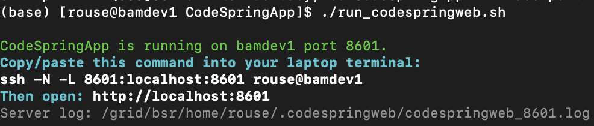
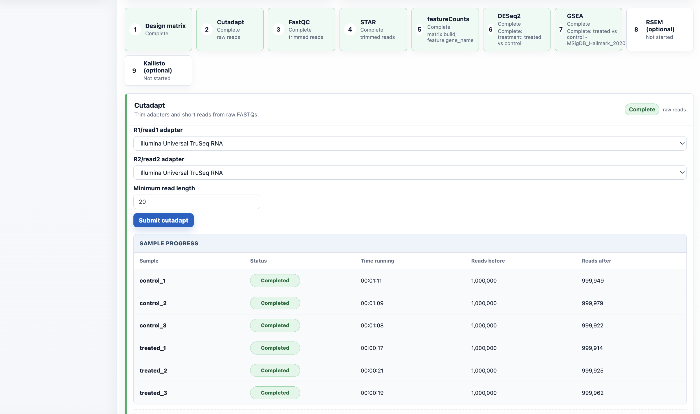
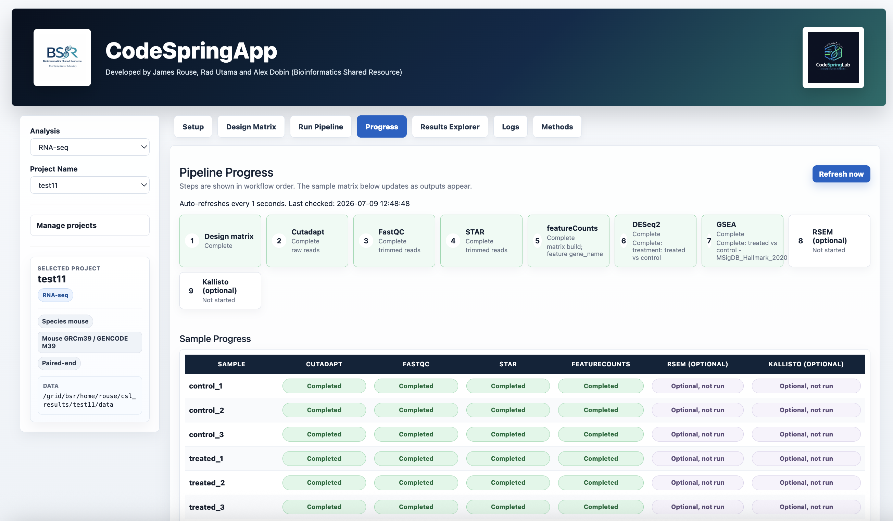

# CodeSpringApp

CodeSpringApp is a Shiny-based control center for running, monitoring, and reviewing CodeSpringLab sequencing projects from one server port. It replaces notebook prompts with a clean, button-driven interface for project setup, design-matrix editing, SLURM submission, progress tracking, logs, methods, and the native CodeSpringLab RNA-seq Results Explorer.

It is designed for shared HPC environments where analyses should continue running after the browser or app is closed.

## Required Companion Repository

CodeSpringApp runs the web interface, but it depends on CodeSpringLab for the analysis scripts, project configs, reference settings, and embedded RNA-seq Results Explorer. Install both repositories in your home directory on the server:

```bash
cd ~
git clone https://github.com/jamesrouse1/CodeSpringLab.git
git clone https://github.com/jamesrouse1/CodeSpringApp.git
```

CodeSpringLab is mandatory for CodeSpringApp. The launcher expects to find it at `~/CodeSpringLab` unless you set `CSL_CODESPRINGLAB_ROOT` manually.
CodeSpringApp does not fall back to a developer's or another user's home directory. If the companion repository cannot be found for the current user, startup stops with an explicit path error.

The launcher derives the account and home directory from the operating system rather than inherited `USER` or `HOME` variables. It refuses to start if the CodeSpringApp checkout, CodeSpringLab checkout, or private app-state directory resolves outside that Unix user's home. The startup output prints the verified Unix user, home, and CodeSpringLab path so they can be checked before opening the browser.

Each launch binds only to the server loopback interface and generates a private 64-character access token. Open the complete URL printed by the launcher, including its `?token=...` value. Tunneling to another user's port without that launch's token shows an access-denied page and does not load their projects.

After the last authorized browser session disconnects, the app process stops automatically after five minutes. Pipeline jobs already submitted to SLURM continue running. Set `CSL_WEB_IDLE_SHUTDOWN_SECONDS` before launching to change the grace period; use `0` to disable automatic shutdown.

Saved project configurations, job history, logs, and last-project selection are stored beneath the current Unix user's `~/.codespringweb` directory. They are not loaded from the cloned repositories, so one user does not inherit another user's project menu. Legacy project configs are migrated only when their exact results data path appears in that user's private job history.

## Bundled Example Datasets

The New Project panel provides a **Use Example Dataset** button for RNA-seq and ATAC-seq. The examples use the small FASTQ and manifest files bundled under `CodeSpringLab/scripts_DoNotTouch/test`:

- RNA-seq: `test/fastq` and `test/manifest`
- ATAC-seq: `test/fastq_atac` and `test/manifest_atac`

Example FASTQs remain read-only inputs. When the project is created, CodeSpringApp copies the bundled design matrix into that user's own `~/csl_results/<project>/data/manifest` directory and writes all results beneath the user's selected results root.

## Folder Browser

The server folder browser starts from the current user's home directory, displays the Unix account used by the app, and hides dotfiles by default. Folders are selectable for navigation, while visible files are listed separately for confirmation. Typed paths are validated before navigation, and empty, hidden-only, missing, and unreadable folders receive distinct messages.

## Run On The Server

Use the launcher script. It checks required packages, finds an open server port, starts Shiny, and prints the exact SSH tunnel command to run from your laptop.

The default starting port is `8601`. If that port is already taken, the launcher automatically tries `8602`, `8603`, and so on until it finds an open port.

On the server:

```bash
cd ~/CodeSpringApp
./run_codespringweb.sh --check-config
./run_codespringweb.sh
```

The optional first command prints the verified Unix user and all identity-sensitive paths without starting the app. Every printed path should belong to the logged-in user.

From your laptop, copy the SSH command printed by the launcher. It will use the port that was actually started:

```bash
ssh -N -L <PORT>:localhost:<PORT> $USER@bamdev1
```

Then open the complete private URL printed by the launcher:

```text
http://localhost:<PORT>/?token=<PRIVATE_TOKEN>
```

Example launcher output. The port in your terminal may differ if the default port is already busy:



## What It Does

- Creates or resumes CodeSpringLab projects from saved project configs.
- Builds and edits design matrices from FASTQ folders.
- Submits real SLURM `sbatch` jobs for cutadapt, FastQC, STAR, featureCounts, DESeq2, GSEA, RSEM, and Kallisto.
- Tracks per-sample and per-comparison progress with completed, running, cancelled, deleted, and likely failed states.
- Resubmits only failed, cancelled, missing, or deleted samples while skipping active and completed jobs.
- Embeds the native CodeSpringLab RNA-seq Results Explorer in the same Shiny app.
- Records logs, methods, tool versions, reference genome selections, and run parameters.

## Preview

### Project Setup

Create new projects, select species/reference builds, browse server folders, and manage project configs/results.

| Project selection | Server folder browser |
| --- | --- |
|  |  |

### Design Matrix

Scan FASTQ folders, include/exclude samples, rename samples, and edit metadata columns directly in the app.


### Run Pipeline

Each step has its own parameters, submit button, status panel, sample progress, cancel controls, and data-delete controls.



### Progress

See workflow-level status and sample-by-step status in a compact matrix.



### Results Explorer

Review QC, count matrices, DESeq2 results, PCA, volcano plots, heatmaps, and GSEA outputs without opening another port.


### Logs And Methods

Browse project logs by tool, sample/run, and output/error type. Export project/reference and tools/reference methods tables.


## Project Discovery

CodeSpringApp stores and discovers project configs separately for each user under:

```text
~/.codespringweb/project_configs/<analysis>/*.py
```

Project configs inside the cloned CodeSpringLab or CodeSpringApp repositories are not displayed. This prevents example, test, or another user's projects from being distributed with the application.

For a new RNA-seq project, the initial FASTQ and design-matrix fields point to CodeSpringLab's bundled example files under `scripts_DoNotTouch/test/fastq` and `scripts_DoNotTouch/test/manifest`. Replace either path when creating a real project. Other analysis types do not receive these RNA-seq defaults.

For new projects, it creates project-local outputs under:

```text
<results_root>/<project_name>/
  data/
  log/
  shiny/
```

## Tabs

- `Setup`: choose analysis/project, create projects, browse server folders, select genome references, and delete configs/results.
- `Design Matrix`: scan FASTQ folders, include/exclude samples, edit metadata, and save a project-local `design_matrix.txt`.
- `Run Pipeline`: submit SLURM jobs with step-specific settings and safeguards.
- `Progress`: monitor step and sample progress, including active, cancelled, deleted, and likely failed states.
- `Results Explorer`: load CodeSpringLab's native RNA-seq Shiny viewer inside CodeSpringApp.
- `Logs`: inspect tool logs and submit logs.
- `Methods`: summarize project metadata, tools, versions, references, and parameters.

## Job Submission

Run buttons submit jobs through `sbatch`, so jobs are owned by SLURM after submission. Closing the browser or stopping Shiny does not cancel jobs already accepted by SLURM.

CodeSpringApp records submitted job metadata under:

```text
~/.codespringweb/
```

Project logs are written under:

```text
<results_root>/<project_name>/log/
```
