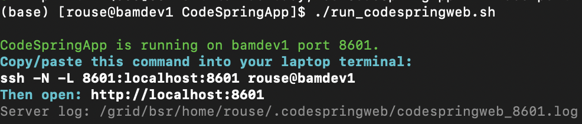
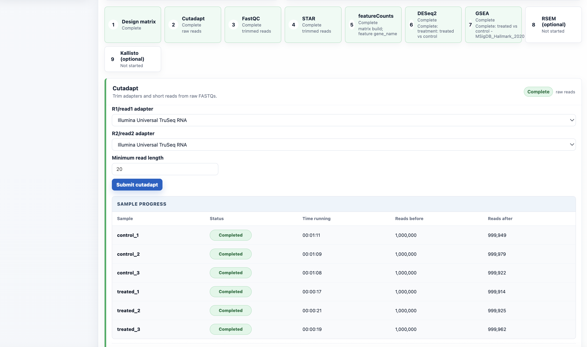
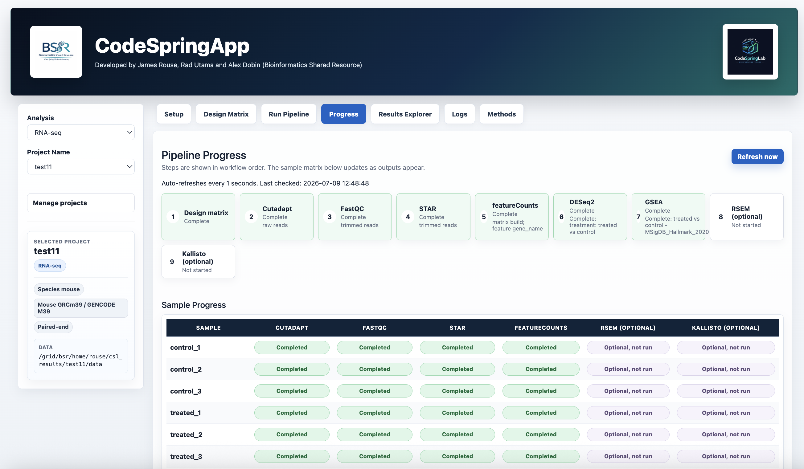

# CodeSpringApp

CodeSpringApp is a Shiny-based control center for fetching public sequencing data and for running, monitoring, and reviewing CodeSpringLab RNA-seq, ATAC-seq, CUT&RUN, and ChIP-seq projects from one server port. It replaces notebook prompts with a button-driven interface for FetchNGS, project setup, design-matrix editing, SLURM submission, progress tracking, logs, methods, and assay-specific Results Explorers.

It is designed for shared HPC environments where analyses should continue running after the browser or app is closed.

## Required Companion Repository

CodeSpringApp runs the web interface, but it depends on CodeSpringLab for the analysis scripts, example data, reference settings, and RNA-seq Results Explorer. Install both repositories in your home directory on the server:

```bash
cd ~
git clone https://github.com/jamesrouse1/CodeSpringLab.git
git clone https://github.com/jamesrouse1/CodeSpringApp.git
```

CodeSpringLab is mandatory for CodeSpringApp. The launcher expects to find it at `~/CodeSpringLab` unless you set `CSL_CODESPRINGLAB_ROOT` manually.
CodeSpringApp does not fall back to a developer's or another user's home directory. If the companion repository cannot be found for the current user, startup stops with an explicit path error.

The launcher derives the account and home directory from the operating system rather than inherited `USER` or `HOME` variables. It refuses to start if the CodeSpringApp checkout, CodeSpringLab checkout, or private app-state directory resolves outside that Unix user's home. Run the explicit `--check-config` diagnostic when those verified paths need to be inspected.

Each launch binds only to the server loopback interface and generates a private 64-character access token. Open the complete URL printed by the launcher, including its `?token=...` value. Tunneling to another user's port without that launch's token shows an access-denied page and does not load their projects.

After the last authorized browser session disconnects, the app process stops automatically after five minutes. Pipeline jobs already submitted to SLURM continue running. Set `CSL_WEB_IDLE_SHUTDOWN_SECONDS` before launching to change the grace period; use `0` to disable automatic shutdown.

Saved project configurations, job history, logs, and last-project selection are stored beneath the current Unix user's `~/.codespringweb` directory. They are not loaded from the cloned repositories, so one user does not inherit another user's project menu. Legacy project configs are migrated only when their exact results data path appears in that user's private job history.

## Bundled Example Datasets

The New Project panel provides a **Use Example Dataset** button for all four analyses. The examples use the small FASTQ and manifest files bundled under `CodeSpringLab/scripts_DoNotTouch/test`:

- RNA-seq: `test/fastq` and `test/manifest`
- CUT&RUN: `test/fastq` and `test/manifest_cutrun` (paired targets with explicit matched IgG controls)
- ATAC-seq: `test/fastq_atac` and `test/manifest_atac`
- ChIP-seq: `test/fastq_chip` and `test/manifest_chip`

Example FASTQs remain read-only inputs. When the project is created, CodeSpringApp copies the bundled design matrix into that user's own `~/csl_results/<project>/data/manifest` directory and writes all results beneath the user's selected results root.

## Folder Browser

The server folder browser starts from the current user's home directory and hides dotfiles by default. Folders are selectable for navigation, while visible files are listed separately for confirmation. Typed paths are validated before navigation, and empty, hidden-only, missing, and unreadable folders receive distinct messages.

## FetchNGS

Choose **FetchNGS** from the main **Analysis type** dropdown to open its isolated
workspace. It runs `nf-core/fetchngs` as a standalone SLURM job. Users can
paste public accessions directly or select a `.txt`, `.csv`, or `.tsv` accession
file already on the server. The app supports full FASTQ retrieval and a
metadata-only mode. Every accepted accession list is copied into the run bundle
as `input/accessions.csv`, matching the filename validation in FetchNGS 1.12.0.

The validated cluster defaults are:

- Nextflow `24.04.4`
- nf-core/fetchngs `1.12.0`
- Singularity `3.6.3`
- Slurm partition `cpuq`
- FetchNGS download method `sratools`

CodeSpringApp supplies an explicit ENA metadata field list that omits the
retired `parent_study` field. This is a compatibility workaround for
nf-core/fetchngs 1.12.0, whose former default request now produces empty
run-information files against the ENA API. New bundles include the corrected
field list, and resuming an older CodeSpringApp bundle adds it automatically
when it is absent.

FTP is not exposed because the tested FetchNGS wget container could not resolve
DNS under the cluster's Singularity 3.6.3 installation. Aspera is not exposed
because it has not yet been validated on this cluster.

Each Unix user gets a private FetchNGS results folder inside the same
`~/csl_results` area used by other CodeSpringApp projects by default:

```text
~/csl_results/
└── fetchngs/
  └── <run-name>/
    ├── input/
    ├── logs/
    ├── results/
    │   ├── fastq/
    │   ├── metadata/
    │   └── samplesheet/
    ├── job_history.txt
    ├── job_id.txt
    ├── params.yml
    ├── run.sbatch
    └── run_manifest.tsv
```

The FetchNGS page also offers **Custom server folder**. The selected path is
used as the exact runs root, so `/project/public_fetchngs` produces
`/project/public_fetchngs/<run-name>/results`. Choosing a custom location changes
run creation, listing, logs, resume, deletion, and output viewing together. The
folder must be an absolute writable server path. Leaving **Default user folder**
selected preserves `~/csl_results/fetchngs`.

Custom results roots receive separate private Nextflow work namespaces beneath
`~/.codespringflow/work/fetchngs/`. This prevents runs with the same name in two
different results roots from sharing resume state or deleting each other's work
files. The namespace and exact work directory are recorded in each run manifest.

Nextflow's non-result runtime files are kept separately:

```text
~/.codespringflow/
├── cache/singularity/
├── tmp/
└── work/fetchngs/<run-name>/
```

The FetchNGS tab shows the resolved output root, discovered runs, Slurm state,
FASTQ and metadata counts, output size, and the newest controller log. A failed
or interrupted run can be selected and resumed with Nextflow's `-resume`
behavior. **Create bundle only** writes and validates the input, parameter,
manifest, and Slurm files without submitting a job.

### FetchNGS accession and download safeguards

CodeSpringApp strictly accepts the accession families documented by
nf-core/fetchngs 1.12.0:

- runs: `SRR`, `ERR`, `DRR`
- experiments: `SRX`, `ERX`, `DRX`
- samples: `SRS`, `ERS`, `DRS`, `SAMN`, `SAMEA`, `SAMD`
- studies: `SRP`, `ERP`, `DRP`
- submissions: `SRA`, `ERA`, `DRA`
- BioProjects: `PRJNA`, `PRJEB`, `PRJDB`
- GEO: `GSM`, `GSE`

Values are converted to uppercase and deduplicated. Any unrecognized format is
rejected before a run folder or Slurm job is created. Server-side accession
files receive the same validation as IDs pasted into the app.

Before a real FASTQ submission, the app requests an ENA run-level file report,
deduplicates overlapping resolved runs, and sums the reported compressed
`fastq_bytes`. By default, a submission is blocked when it resolves to more
than 20 unique runs or its known compressed FASTQs exceed 50 GB.

When ENA cannot provide a usable size for one or more accessions, the app does
not fail the whole request. It pauses before creating or submitting the job and
opens a prominent decision dialog:

- **Skip unknown-size accessions** converts the request to the resolved run IDs
  with known sizes, excluding the affected runs or unresolved input accessions.
  If every requested accession is unknown, the app explains that nothing is
  left to submit instead of creating an empty job.
- **Continue with unknown sizes** keeps the original accession list. The user
  must tick a separate risk acknowledgement before submission. The known
  portion must still pass the configured size and storage limits, but the total
  download, temporary-space need, and number of runs behind an unresolved
  study/project cannot be guaranteed and the workflow may fail.

Metadata-only mode remains available and does not require a size estimate.

The app also checks free space before submission. When results and private
Nextflow work use the same filesystem, free space must be at least four times
the estimated compressed FASTQ size. When they use different filesystems, one
copy is reserved for final results and the remaining allowance is required on
the runtime/work filesystem. This accounts approximately for the larger
temporary files created by `sra-tools`; it is a pre-submission safety check,
not a storage reservation.

The same checks run again before **Resume selected run** submits a non-metadata
workflow. When Skip is chosen during resume, the app backs up the run's original
`accessions.csv` and replaces it with the known-size resolved run list before
calling Nextflow with `-resume`. Therefore, creating a bundle with **Create
bundle only** cannot bypass the preflight or the explicit unknown-size decision.

FetchNGS status messages are severity-aware. Errors appear in a high-contrast
red alert with an **Action needed** heading; checks and unresolved-size choices
appear in amber; successful updates appear in green.

Administrators can change these server-side limits before launching the app:

```bash
export CSL_FETCHNGS_MAX_RUNS=20
export CSL_FETCHNGS_MAX_DOWNLOAD_GB=50
export CSL_FETCHNGS_STORAGE_MULTIPLIER=4
export CSL_FETCHNGS_ENA_TIMEOUT_SECONDS=30
```

These limits are displayed to users but have no normal user-interface override.

The **FetchNGS Outputs** tab lists files beneath the selected run's `results/`
folder. CSV, TSV, and TXT files are shown as capped interactive tables; JSON,
YAML, Markdown, and log files receive a capped text preview. Large or binary
files such as compressed FASTQs are listed with their path, type, size, and
modification time without being loaded into the browser. The inventory is
limited to the first 2,000 files and six folder levels so opening a large run
cannot indefinitely block the Shiny session.

The output viewer has its own **Results location to view** selector. It always
includes the default `~/csl_results/fetchngs` location and remembers readable
custom locations for the current Unix user. Use **Add an older results folder**
to select the folder that directly contains older `<run-name>/results/`
directories. This viewer choice does not change the destination used for new
FetchNGS runs.

**Delete selected run** asks for confirmation and removes only that run's folder
beneath the currently selected results root and its matching private Nextflow
work directory. It refuses to delete a run whose recorded SLURM job is still
active, and it never removes the shared Singularity cache.

FetchNGS only retrieves data. It does not automatically launch CUT&RUN, Sarek,
or another analysis workflow. A downloaded FASTQ folder can later be selected
through the normal CodeSpringApp project setup controls.

To override either location, set the applicable root before starting the app:

```bash
export CSL_FETCHNGS_RESULTS_ROOT=/path/to/csl_results/fetchngs
export CSL_FETCHNGS_RUNTIME_ROOT=/path/to/private/fetchngs_runtime
./run_codespringweb.sh
```

## Run On The Server

Use the launcher script. It checks required packages, finds an open server port, starts Shiny, and prints the exact SSH tunnel command to run from your laptop.

By default, each Unix account receives its own predictable private block of 100 ports, derived from its Unix user ID. This means two people launching CodeSpringApp at the same time do not contend for port `8601`. The launcher selects the first free port in that user's block and prints the exact tunnel command and URL. To deliberately start from a particular port, pass it as an argument (for example, `./run_codespringweb.sh 8601`).

On the server:

```bash
cd ~/CodeSpringApp
./run_codespringweb.sh --check-config
./run_codespringweb.sh
```

The optional first command prints the verified Unix user and all identity-sensitive paths without starting the app. Every printed path should belong to the logged-in user.

From your laptop, copy the SSH command printed by the launcher. It will use the port that was actually started:

```bash
ssh -N -L <PORT>:localhost:<PORT> $USER@<DEV_NODE>
```

Then open the complete private URL printed by the launcher:

```text
http://localhost:<PORT>/?token=<PRIVATE_TOKEN>
```

`<DEV_NODE>` is the node where you ran `./run_codespringweb.sh` (for example,
`bamdev2`). The launcher detects and prints it automatically. If your cluster
uses a different SSH alias or gateway, set `CSL_WEB_SSH_HOST` before launching
to print that address instead.

Example launcher output. The port in your terminal may differ if the default port is already busy:



## What It Does

- Retrieves public sequencing data through a standalone nf-core/fetchngs SLURM workflow.

### Single-cell RNA-seq

The scRNA-seq project type accepts a Seurat RDS, Scanpy H5AD, or filtered 10x
matrix directory from a server path, or a Seurat/Scanpy object uploaded from a
laptop. For a single input, setup stays manifest-free: CodeSpring derives the
sample ID from the selected file/folder name and keeps the required one-row
record internally. Choose **Multiple inputs or integration** only when samples
come from more than one location or an integration workflow is intended; that
selection reveals the editable project-local manifest. Existing multi-sample
manifests remain supported.

Choose the **Results root** in project setup; the app writes the processed
object, figures, tables, logs, and job temporary storage under
`<results_root>/<project_name>/data/scrna/`. Source objects and matrices are
never changed. Input inspection, QC/doublets, normalization/PCA,
integration/clustering, and annotation/markers each run as their own SLURM
job. Each successful stage writes a checkpoint, so later stages resume from
the appropriate saved state rather than repeating earlier work.

The selected engine is explicit: Seurat for RDS/10x and Scanpy for H5AD/10x.
The job wrapper loads and checks the relevant cluster runtime only on the
compute node. On the BSR cluster, Scanpy automatically uses the shared,
read-only image at
`/grid/bsr/data/data/bsr_readable_data/containers/scanpy/codespring-scanpy_1.0.0.sif`.
Maintainers can override that location by setting `CSL_SCANPY_SIF` before
starting CodeSpringApp.

Seurat jobs use the official versioned cluster Seurat module in a clean R
library context, preventing personal packages from overriding its compatible
dependencies.

For multi-sample single-cell projects, `capture_id` records the independent
droplet capture used for doublet detection and defaults to `sample_id`.
Multiplexed samples from one 10x channel should share a `capture_id`. CodeSpring
performs only a minimal low-count prefilter, calls doublets independently per
capture with an automatically estimated rate, and then applies the complete QC
thresholds per sample before normalization and integration.

- Creates or resumes CodeSpringLab projects from saved project configs.
- Builds and edits design matrices from FASTQ folders.
- Submits real SLURM `sbatch` jobs for RNA-seq tools plus ATAC-seq, CUT&RUN, and ChIP-seq Bowtie2/peak-calling/differential workflows.
- Supports explicit sample selection for sample-level runs and cancellations across RNA-seq, ATAC-seq, CUT&RUN, and ChIP-seq, plus explicit target-to-control pairing for ChIP-seq.
- Shows checked sample lists inside every sample-level tool card; unchecking a sample excludes it from that step without changing the saved experimental design.
- Tracks per-sample and per-comparison progress with completed, running, cancelled, deleted, and likely failed states.
- Keeps untouched or partial sample outputs at `Not started` until SLURM reports a terminal job state; only a finished unsuccessful or incomplete job is classified as failed.
- Resubmits only failed, cancelled, missing, or deleted samples while skipping active and completed jobs.
- Uses one Results Explorer format across RNA-seq, ATAC-seq, CUT&RUN, and ChIP-seq: every explorer starts with Overview, includes QC and assay-specific results, and ends with a categorized Files view. Analysis selectors also share one canonical order, spelling, description style, and 3:9 control/content layout.
- Renders paired-end fragment-size PDFs as standardized in-app images instead of native browser PDF previews, and keeps fragment plots at a consistent display size across samples.
- Sorts numeric-looking table values numerically, including comma-formatted counts, percentages, elapsed times, and human-readable file sizes such as KB/MB/GB.
- Filters CUT&RUN result files by category and sample before choosing an individual file.
- Keeps every result-file view scoped to the currently selected project, including after switching between projects, and reports bigWig/bedGraph normalization in the ATAC-seq, CUT&RUN, and ChIP-seq signal-track views.
- Embeds an IGV genome browser in the ATAC-seq, CUT&RUN, and ChIP-seq Results Explorers. Users can compare up to eight samples, search by gene or genomic locus, and overlay project bigWig signal with optional BED, narrowPeak, or broadPeak calls. Track data are served through session-scoped, byte-range-aware URLs rather than exposing project directories.
- Records logs, methods, tool versions, reference genome selections, and run parameters.

### ChIP-seq workflow

ChIP-seq is a complete CodeSpringLab workflow in the app: Cutadapt and FastQC, single- or paired-end Bowtie2 alignment, duplicate-removed CPM bigWigs, matched-input MACS2 narrow or broad peaks, and target-only DiffBind/DESeq2 comparisons. Every ChIP target must identify an explicit `reference=input` sample through `control_sample`; input libraries are used during MACS2 and are not counted as DiffBind replicates.

New ChIP-seq projects use the current references only: mouse GRCm39/GENCODE M39 or human GRCh38/GENCODE v50. The Results Explorer reports target/input roles, matched controls, alignment retention, MACS2 parameters and peak counts, and completed differential-binding comparisons.

## Preview

### Project Setup

Create new projects, select species/reference builds, browse server folders, and manage project configs/results.

| Project selection | Server folder browser |
| --- | --- |
|  |  |

### Design Matrix

Scan FASTQ folders, include/exclude samples, rename samples, and edit metadata columns directly in the app. A provided matrix loads into the same visible input grid. Projects without a matrix receive blank editable rows, with a button to add five more rows at a time.


### Run Pipeline

Each step has its own parameters, submit button, status panel, sample progress, cancel controls, and data-delete controls. Cancellation dialogs show only active tracked jobs and allow exact sample selection when sample identities are available.

The launcher stops only CodeSpringApp processes owned by the current Unix account. Unrelated R or Shiny processes are not treated as CodeSpringApp sessions.



### Progress

See workflow-level status and sample-by-step status in a compact matrix.



### Results Explorer

Review assay-appropriate QC, alignment metrics, signal tracks, peaks, differential results, count matrices, PCA, volcano plots, heatmaps, and GSEA outputs without opening another port. ATAC-seq, CUT&RUN, and ChIP-seq design matrices can also be edited and saved from their Results Explorer overview.


### Logs And Methods

Browse project logs by tool, sample/run, and output/error type. Export project/reference and tools/reference methods tables.


## Project Discovery

CodeSpringApp stores and discovers project configs separately for each user under:

```text
~/.codespringweb/project_configs/<analysis>/*.py
```

Project configs inside the cloned CodeSpringLab or CodeSpringApp repositories are not displayed. This prevents example, test, or another user's projects from being distributed with the application.

For a new RNA-seq project, the initial FASTQ and design-matrix fields point to CodeSpringLab's bundled RNA-seq example. The **Use Example Dataset** button loads the matching bundled paths for RNA-seq, CUT&RUN, ATAC-seq, or ChIP-seq. Replace either path when creating a real project.

For new projects, it creates project-local outputs under:

```text
<results_root>/<project_name>/
  data/
  log/
  shiny/
```

## Tabs

- The `Analysis type` dropdown treats `FetchNGS` as a separate data-retrieval workflow. Selecting it hides biological-project controls and analysis tabs; selecting RNA-seq, scRNA-seq, ATAC-seq, CUT&RUN, or ChIP-seq restores the normal project workspace.
- `Setup`: choose analysis/project, create projects, browse server folders, select genome references, and delete configs/results.
- `FetchNGS`: shown only when FetchNGS is selected; paste or select public accessions, submit or resume downloads, inspect run status, and read controller logs.
- `FetchNGS Outputs`: shown only when FetchNGS is selected; choose current or remembered results locations, inventory a selected run's result files, and safely preview supported tables and text outputs.
- `Design Matrix`: scan FASTQ folders, include/exclude samples, edit metadata, and save a project-local `design_matrix.txt`.
- `Run Pipeline`: submit SLURM jobs with step-specific settings and safeguards.
- `Progress`: monitor step and sample progress, including active, cancelled, deleted, and likely failed states.
- `Results Explorer`: open the native RNA-seq viewer or the assay-specific ATAC-seq, CUT&RUN, or ChIP-seq explorer.
- `Logs`: inspect tool logs and submit logs.
- `Methods`: summarize project metadata, tools, versions, references, and parameters.

## Job Submission

Run buttons submit jobs through `sbatch`, so jobs are owned by SLURM after submission. Closing the browser or stopping Shiny does not cancel jobs already accepted by SLURM.

CodeSpringApp records submitted job metadata under:

```text
~/.codespringweb/
```

Project logs are written under:

```text
<results_root>/<project_name>/log/
```

FetchNGS controller logs and nf-core execution reports are stored under
`~/csl_results/fetchngs/<run-name>/logs/` by default.

## Tests

With CodeSpringLab checked out beside this repository, run:

```bash
bash tests/run_all.sh ../CodeSpringLab
```

This first performs a FetchNGS bundle smoke test without Slurm or network
access. It then validates project setup, example datasets, pipeline step
selection, output detection, retry behavior, paired- and single-end
STAR/Kallisto/RSEM/featureCounts SLURM arguments, Results Explorer helpers, and
launcher path isolation without submitting cluster jobs.
